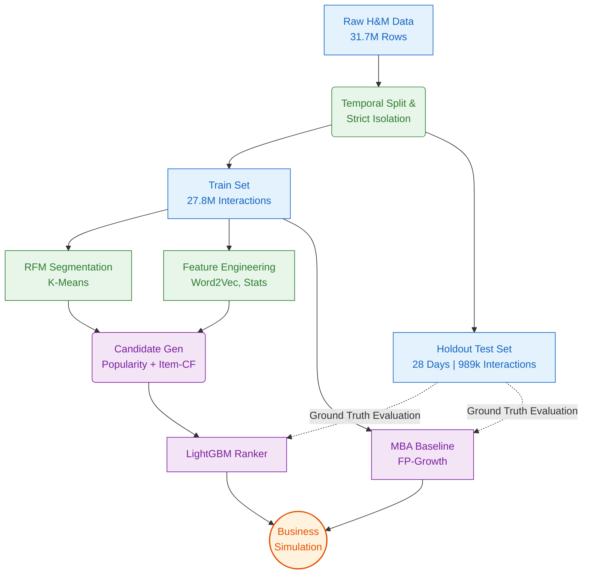
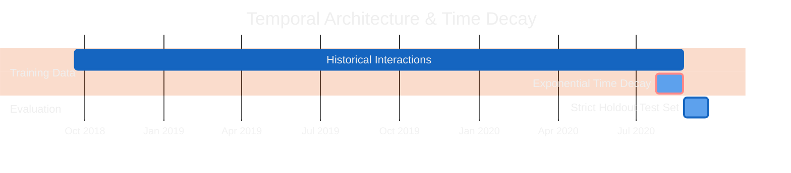
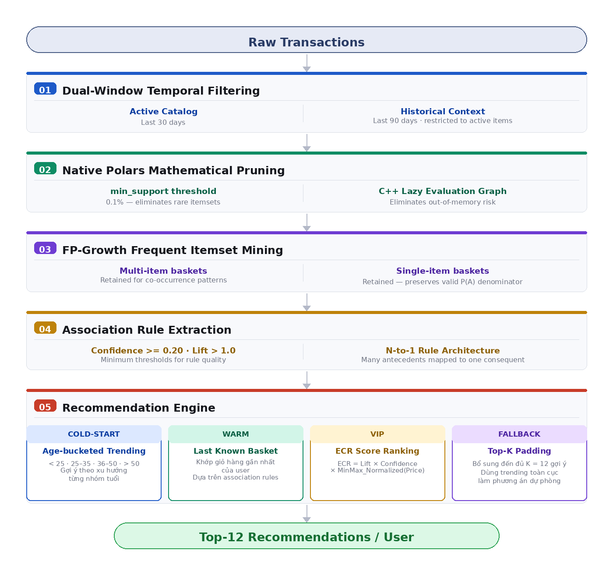
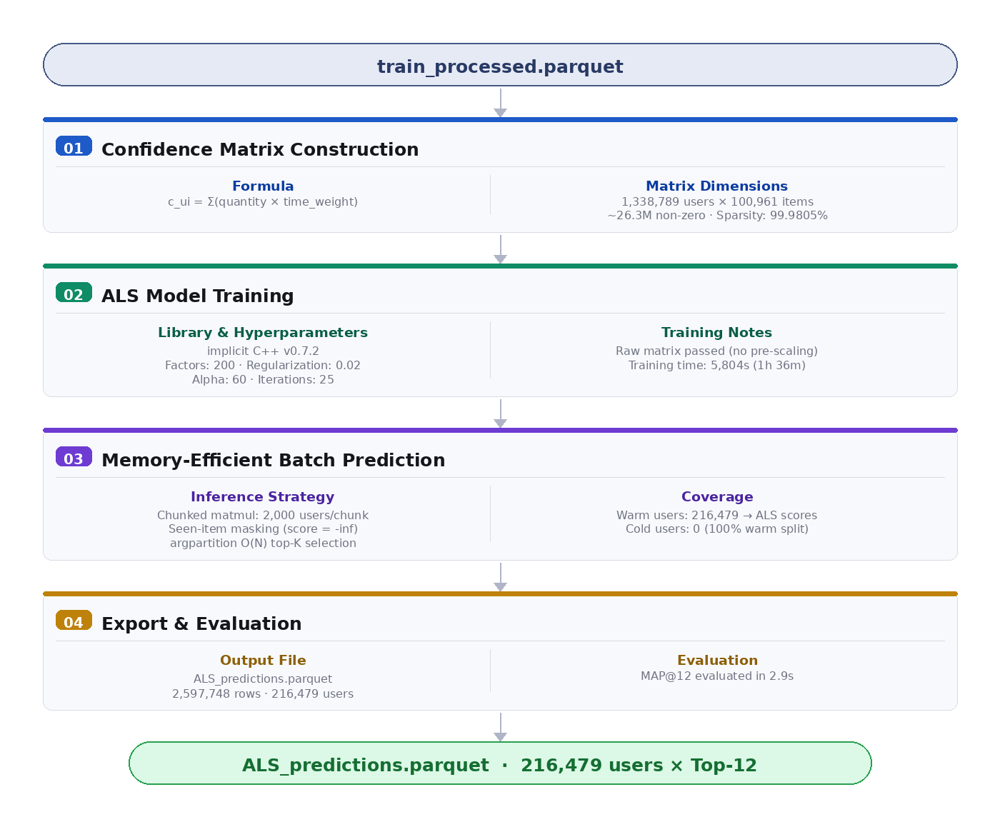
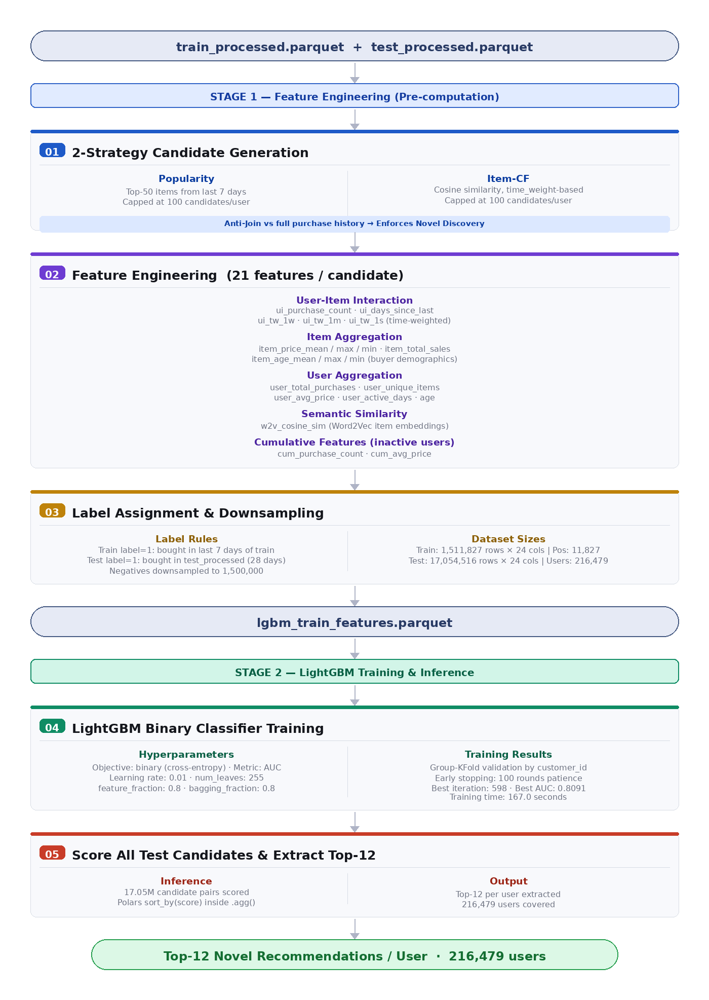
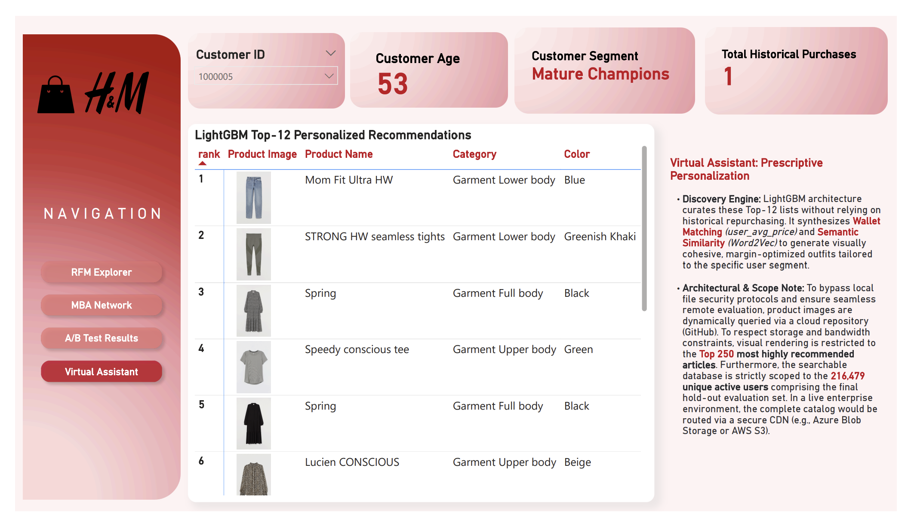
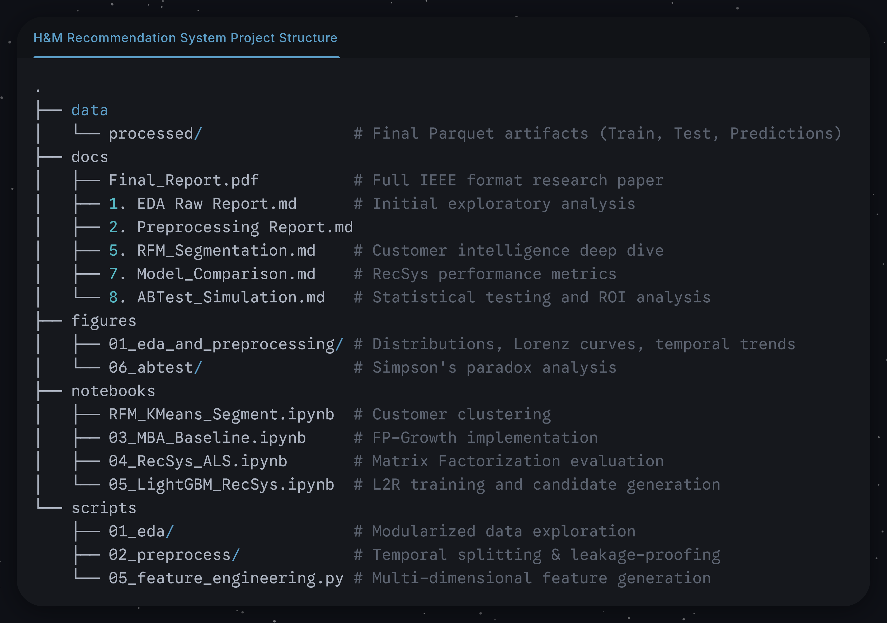

# DSEB 65A - Group 4 — H&M Recommendation System & Customer Intelligence

-success?style=flat)
 

A comprehensive data-driven marketing architecture built on ~31.7 million H&M transactions. This project bridges raw behavioral data and actionable customer segmentation to optimize product discovery and maximize customer lifetime value.

The final LightGBM learning-to-rank model demonstrates a 71% uplift in conversion propensity while strictly enforcing novel discovery (preventing trivial repurchase predictions).

---

## System Architecture

## 1. Data Foundation & Strict Temporal Isolation

Building a reliable recommender for fast fashion requires confronting severe popularity bias, a 99.98% interaction matrix sparsity, and extremely short item shelf lives (most products are active for < 90 days).

### The 28-Day Holdout Philosophy

We sequestered the final **28 days** of the dataset as an immutable holdout evaluation set. While standard fast-fashion benchmarks often use a 7-day window, a 28-day holdout captures nearly **1 million interactions (989,221)** across 216,479 unique active users. This massive evaluation volume natively suppresses variance and proves the architecture's stability against mid-term temporal drift, ensuring our metrics are highly statistically significant rather than an artifact of a single "lucky" week.

### Preprocessing & Leakage-Prevention
*   **Time-Decay Anchoring:** An exponential time decay (30-day half-life) was applied to the interaction matrix. This decay was anchored to the training period's cutoff (`2020-08-24`) to ensure obsolete seasonal inventory was phased out naturally without artificially discounting the freshest training data relative to the test set.
*   **Affinitive Imputation:** Rather than filling missing age data (1.16%) with global medians, demographics were inferred using the user's dominant purchase category history (e.g., users dominating the `Divided` youth line were imputed as 29). This preserved the bimodal variance necessary for accurate K-Means clustering.
*   **Reseller Purge:** Wholesale accounts (e.g., users purchasing >1,000 items) were purged strictly based on training-set history to prevent popularity bias inflation.

### Processed Feature Dictionary

Click to expand Data Dictionaries

**Interaction Matrix (`train_processed.parquet`)**
| Feature       | Type    | Purpose                                                |
| :------------ | :------ | :----------------------------------------------------- |
| `t_dat`       | Date    | Transaction Timestamp                                  |
| `customer_id` | Int32   | Mapped Primary Key (Zero-indexed)                      |
| `article_id`  | Int32   | Mapped SKU Identifier                                  |
| `price`       | Float64 | Normalized Purchase Price                              |
| `quantity`    | UInt32  | Aggregated Unit Volume (resolves 17% exact duplicates) |
| `days_ago`    | Int64   | Days since Training Max Date                           |
| `time_weight` | Float64 | Exponential Decay (30d half-life)                      |

**Demographic Matrix (`customers_processed.parquet`)**
| Feature         | Type   | Purpose                                              |
| :-------------- | :----- | :--------------------------------------------------- |
| `age`           | Int8   | Affinitively Imputed Age                             |
| `FN` / `Active` | Int8   | Binary flags (Nulls imputed to 0)                    |
| `postal_code`   | String | Masked Location Hash (Mega-node mapped to `Unknown`) |

## 2. Customer Intelligence & RFM Segmentation

The prescriptive marketing logic relies on segmenting the 1.37M customer base into distinct economic clusters using Yeo-Johnson transformed K-Means. We prioritize economic utility over pure geometric symmetry.

| Segment              | Headcount | Revenue Share | Median Profile   | Operating Tactic                                                      |
| :------------------- | :-------- | :------------ | :--------------- | :-------------------------------------------------------------------- |
| **Young Whales**     | 23.36%    | **54.35%**    | Age 26, Freq: 11 | Zero-discount upselling; margin density focus.                        |
| **Mature Champions** | 15.60%    | **31.08%**    | Age 51, Freq: 9  | Retention and replenishment; relevance stability.                     |
| **Young At-Risk**    | 23.85%    | 5.29%         | Age 27, Freq: 1  | Margin-controlled win-back; historically high-conversion SKU routing. |
| **Mature Newcomers** | 19.98%    | 4.41%         | Age 53, Freq: 1  | Certainty-first demographic priors until history builds.              |
| **Young Core**       | 17.21%    | 4.87%         | Age 25, Freq: 2  | Basket stretching and category cross-selling.                         |

*Finding:* A Pareto-like concentration exists where **Whales + Champions represent 39% of headcount but command 85% of total revenue**. Furthermore, Markov chain analysis revealed a ~61% "stickiness" in `Ladieswear` and a clear evolutionary pipeline mapping users aging out of the `Divided` youth index directly into mature lines.

## 3. Predictive Architectures & Pipeline Engineering

To establish a definitive performance hierarchy, we evaluated models strictly on **Novel Discovery**. By enforcing an anti-join against a user's full purchase history during candidate generation, the system was barred from artificially inflating Hit Rates via trivial repurchases.

**Evaluation Set:** 216,479 warm users (Final 28 days holdout)

| Model Architecture              | Methodology                    | MAP@12     | Hit Rate@12 |
| :------------------------------ | :----------------------------- | :--------- | :---------- |
| **MBA Baseline**                | Explainable FP-Growth rules    | 0.0045     | 4.44%       |
| **ALS (Matrix Factorization)**  | 1-to-1 implicit latent factors | 0.0063     | 4.83%       |
| **LightGBM (Learning-to-Rank)** | Multi-feature boosted ranking  | **0.0075** | **7.66%**   |

### 3.1 Checkout Impulse (MBA Baseline)
To solve the fast-fashion "Dead-Stock Trap" (recommending obsolete items), we implemented a dual-window temporal heuristic. This engine serves as our high-speed, $O(1)$ dictionary lookup for active shopping carts, utilizing an Expected Cross-Sell Revenue (ECR) heuristic to push premium bundles to VIP segments.

  

### 3.2 Collaborative Filtering (Matrix Factorization)
The ALS model transitions from generalized rules to true 1-to-1 latent personalization. While mathematically rigorous, simulation revealed it suffers from extreme popularity bias—relying heavily on dense interaction histories, which causes it to fail on newly acquired or dormant consumers.

  

### 3.3 The Winning Engine: LightGBM (Learning-to-Rank)
The L2R framework reframes recommendation as a supervised classification problem. By evaluating features like semantic similarity (`w2v_cosine_sim`) and wallet-matching (`user_avg_price`), this context-rich approach overcomes the sparse-user deficit found in other models.

  

## 4. Randomized Controlled Trial & The "ROI Trap"

Through a simulated deployment environment, we analyzed the economic impact of three recommendation architectures. The goal was to maximize Incremental Recommendation Revenue (IRR) across all customer segments without falling into the "ROI Trap" of mathematically significant but financially negligible models. While ALS showed a statistically significant +9.36% aggregate Hit Rate uplift over the baseline, segment-stratified analysis revealed a severe **Simpson's Paradox**: it boosted "Whales" (+12%) but **actively harmed dormant users**—"Young At-Risk" dropped by -33.5% and "Mature Newcomers" dropped by -19.1%. It indiscriminately pushed cheap basics instead of culturally relevant fashion, resulting in zero actual economic revenue shift (The ROI Trap).

### LightGBM Dominance & Deployment Mandate
Conversely, LightGBM generated massive uplifts in *every single segment*, effectively doubling the overall IRR. We mandate a **Dual-Engine Prescriptive Logic**:
1.  **Homepage / Navigation (LightGBM):** Handles asynchronous, computationally heavy personalization to govern the largest IRR opportunity.
2.  **Checkout Cart (MBA FP-Growth):** Retained for real-time impulse generation, capitalizing on high-speed association rules for active sessions.

## 5. Executive BI Dashboard

To operationalize these findings, we developed a 4-tab interactive dashboard allowing stakeholders to explore customer segments, product affinity networks, and live A/B test results.

| Tab | Focus | Key Insight |
| :--- | :--- | :--- |
| **RFM Explorer** | Descriptive Analytics | Visualizes the Pareto concentration where 39% of users drive 85% of revenue. |
| **MBA Network** | Association Rules | Maps the "Gravity Well" of Ladieswear using interactive chord diagrams. |
| **A/B Test Results** | Business Impact | Surfaces the Simpson's Paradox and quantifies the $22.9K NRU annual yield. |
| **Virtual Assistant** | Model Inference | A live demo showing personalized Top-12 recommendations for any User ID. |

  <a href="[POWERBI_LINK](https://drive.google.com/drive/folders/17R1_ZM1MguQdwQFNwbqP0yBn5N8KA0_t?usp=sharing)">
    
     
    <b>View Live Interactive Dashboard</b>
  </a>

## 6. Project Structure

## 7. Contributions

*   **Class:** DSEB 65A
*   **Course:** Data Driven Marketing
*   **Group:** Group 4

| Student ID | Full Name | Task Assignment |
| :---: | :---: | :---: |
| 11230517 | Vũ Ngọc Hồng Anh | Customer Intelligence, RFM Segmentation & K-Means Profiling |
| 11230527 | Đỗ Tuấn Đạt | Algorithmic Architecture, LightGBM Ranker & Personalization |
| 11230553 | Hàn Chí Kiên | Exploratory Data Analysis, Temporal Isolation & Pipeline Engineering |
| 11230570 | Phạm Hồng Minh | Association Discovery, MBA Baseline & ECR Heuristics, PowerBI (Present Ver) |
| 11230584 | Chu Bích Phương | Data Integrity, Validation & Final Report Compiler |
| 11230588 | Nguyễn Thanh Thảo **(Leader)** | All Tasks Code Optimization, A/B Testing - RCT Simulation & Business Analysis, Business Action Plan, PowerBI (Advanced Ver) |
