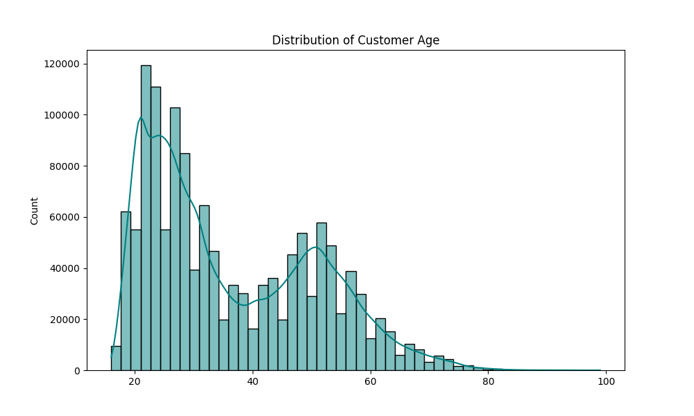
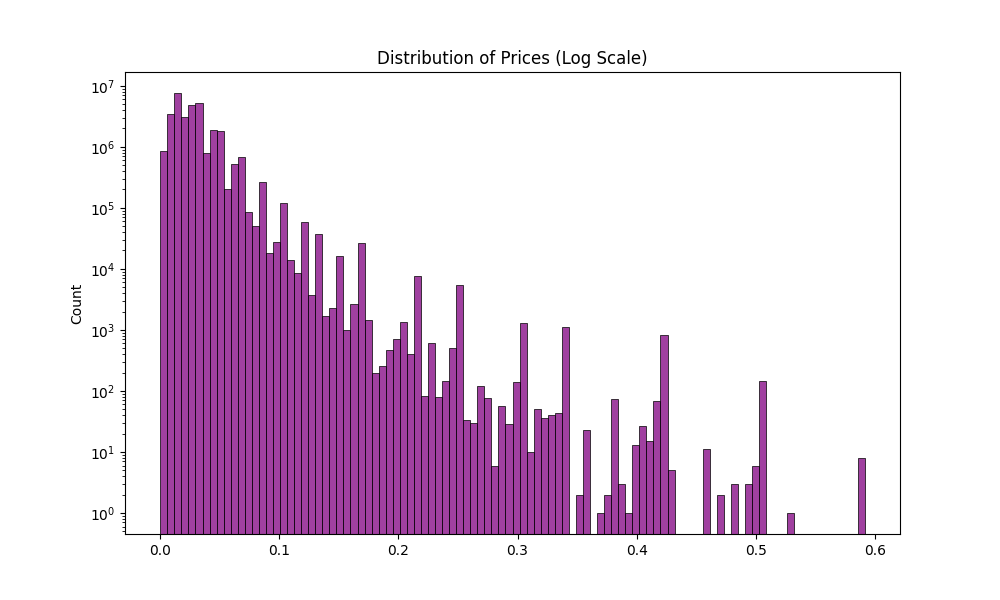
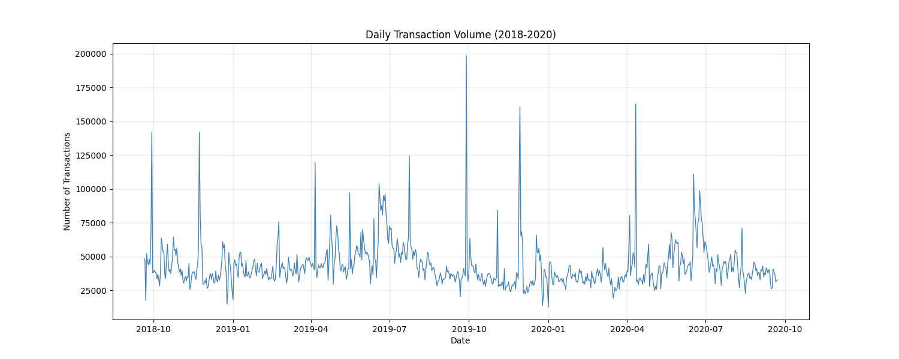
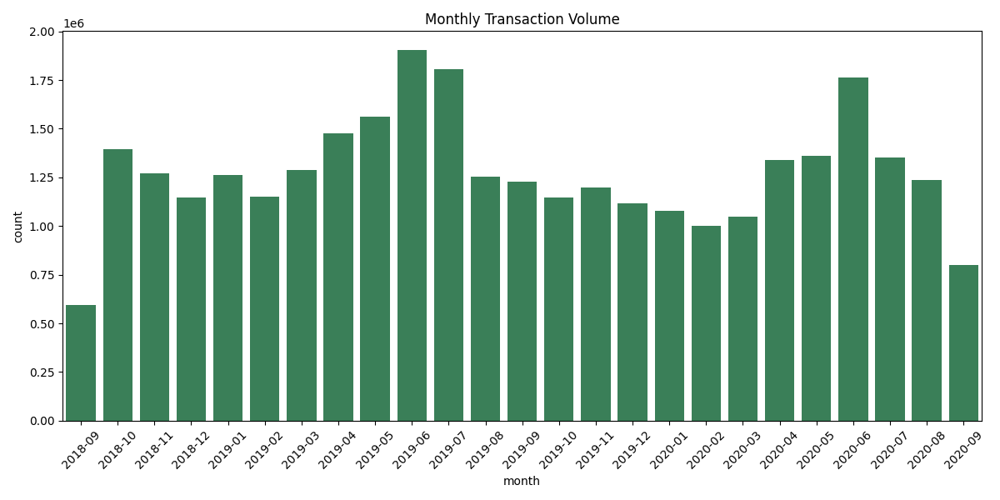
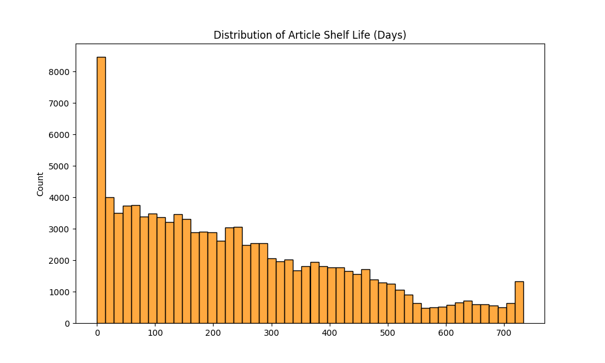
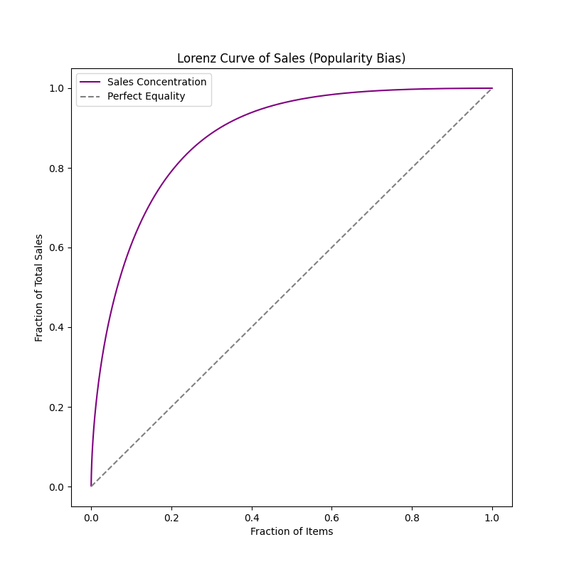
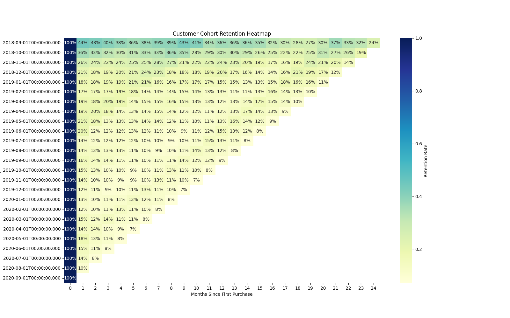
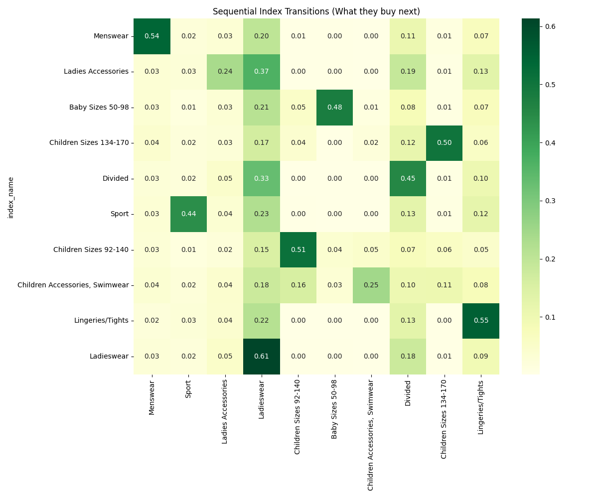
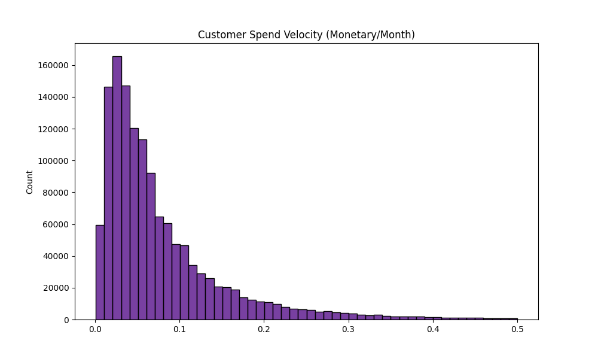

# Comprehensive EDA Report: Customer & Transaction Analysis

## 1. Executive Summary

This report presents an exhaustive Exploratory Data Analysis (EDA) of a high-volume retail dataset containing ~31.7M transactions, 1.37M customers, and 105k articles. The analysis reveals a "Fast Fashion" dynamic characterized by extreme matrix sparsity (99.98%), significant customer churn (45.5% inactive > 6 months), and high SKU turnover (short article shelf life). Despite these challenges, the data exhibits perfect referential integrity and strong demographic segmentation, providing a solid foundation for advanced recommendation systems and customer lifetime value (CLV) modeling.

## 2. Data Dictionary & Structural Metadata

The dataset consists of three core tables processed into Parquet format using `polars` for optimal memory efficiency and I/O speed.

### 2.1. Articles (`articles.parquet`)
- **Purpose**: Master catalog of all products with rich categorical metadata.
- **Scale**: 105,542 rows | 25 columns | Size: ~36.38 MB (Parquet)

::: {tbl-colwidths="[20,10,8,15,22,25]"}

| Feature                       | Type   | Null % | Range / Uniques        | Sample                 | Purpose                   |
| :---------------------------- | :----- | :----- | :--------------------- | :--------------------- | :------------------------ |
| `article_id`                  | Int64  | 0.00%  | [108775015, 959461001] | 108775015              | Primary Key               |
| `product_code`                | Int64  | 0.00%  | [108775, 959461]       | 108775                 | High-level SKU identifier |
| `prod_name`                   | String | 0.00%  | 45,875 unique          | Strap top              | Product Name              |
| `product_type_name`           | String | 0.00%  | 131 unique             | Vest top               | Granular category         |
| `product_group_name`          | String | 0.00%  | 19 unique              | Garment Upper body     | High-level category       |
| `graphical_appearance_name`   | String | 0.00%  | 30 unique              | Solid                  | Pattern/Texture           |
| `colour_group_name`           | String | 0.00%  | 50 unique              | Black                  | Primary color             |
| `perceived_colour_value_name` | String | 0.00%  | 8 unique               | Dark                   | Color tone                |
| `department_name`             | String | 0.00%  | 250 unique             | Jersey Basic           | Internal department       |
| `index_name`                  | String | 0.00%  | 10 unique              | Ladieswear             | Macro department          |
| `section_name`                | String | 0.00%  | 56 unique              | Womens Everyday Basics | Store section             |
| `garment_group_name`          | String | 0.00%  | 21 unique              | Jersey Basic           | Manufacturing group       |
| `detail_desc`                 | String | 0.39%  | 43,405 unique          | Jersey top with...     | Product description       |

:::

### 2.2. Customers (`customers.parquet`)
- **Purpose**: Customer demographic and loyalty program metadata.
- **Scale**: 1,371,980 rows | 7 columns | Size: ~214.99 MB (Parquet)

:::{tbl-colwidths="[20,10,8,15,22,25]"}

| Feature                  | Type    | Null % | Range / Uniques  | Sample          | Purpose                         |
| :----------------------- | :------ | :----- | :--------------- | :-------------- | :------------------------------ |
| `customer_id`            | String  | 0.00%  | 1,371,980 unique | 00000dbacae5... | Hexadecimal Primary Key         |
| `FN`                     | Float64 | 65.24% | [1.0, 1.0]       | 1.0             | Fashion News flag (Null = No)   |
| `Active`                 | Float64 | 66.15% | [1.0, 1.0]       | 1.0             | Active profile flag (Null = No) |
| `club_member_status`     | String  | 0.44%  | 4 unique         | ACTIVE          | Membership lifecycle status     |
| `fashion_news_frequency` | String  | 1.17%  | 5 unique         | NONE            | Comm frequency                  |
| `age`                    | Int64   | 1.16%  | [16, 99]         | 49              | Customer age                    |
| `postal_code`            | String  | 0.00%  | 352,899 unique   | 52043ee2162c... | Hashed location identifier      |

:::

### 2.3. Transactions (`transactions_train.parquet`)
- **Purpose**: The core interaction log between customers and articles.
- **Scale**: 31,788,324 rows | 5 columns | Size: ~2.97 GB (Parquet)

:::{tbl-colwidths="[20,10,8,15,22,25]"}

| Feature            | Type    | Null % | Range / Uniques        | Sample          | Purpose                          |
| :----------------- | :------ | :----- | :--------------------- | :-------------- | :------------------------------- |
| `t_dat`            | String  | 0.00%  | 734 unique days        | 2018-09-20      | Transaction Date                 |
| `customer_id`      | String  | 0.00%  | 1,362,281 unique       | 000058a12d5b... | Foreign Key (Customers)          |
| `article_id`       | Int64   | 0.00%  | [108775015, 956217002] | 663713001       | Foreign Key (Articles)           |
| `price`            | Float64 | 0.00%  | [1.69e-05, 0.591]      | 0.0508          | Normalized Price                 |
| `sales_channel_id` | Int64   | 0.00%  | [1, 2]                 | 2               | Channel ID (1: Online, 2: Store) |

:::

## 3. Data Integrity & Foundational Quality

### 3.1. Missingness & Completeness
- **Referential Integrity**: 100%. Every `customer_id` and `article_id` present in `transactions_train.parquet` successfully maps to a record in their respective metadata tables.
- **Null Values**: 
  - The `transactions` table is perfectly complete (0% nulls).
  - In `customers`, `FN` and `Active` flags have ~65% nulls. These are binary flags where `Null` should be safely imputed as `0` or `False`.
  - `age` has a 1.16% missing rate, requiring **Affinitive Age Imputation** (lookup based on a user's dominant purchasing category) for downstream modeling.

### 3.2. Redundancy & Duplication
- **Exact Duplicates**: The `transactions` table contains **5,518,813 duplicate rows (17.36%)**.
- **Interpretation**: Given the absence of a `quantity` column, an exact match on `(t_dat, customer_id, article_id, price, sales_channel_id)` represents a customer buying multiple units of the exact same SKU in a single transaction event.
- **Technical Note**: Identified using Polars' high-performance duplicate detection: `df.filter(pl.struct(df.columns).is_duplicated())`. These rows are grouped and aggregated into a `quantity` feature prior to model training to prevent target leakage or skewed engagement metrics.

## 4. Univariate & Demographic Analysis

### 4.1. The Bimodal Customer Base
Age distribution analysis reveals a heavily bimodal demographic structure.
- **Primary Peak (Youth)**: High concentration around age **25**.
- **Secondary Peak (Mature)**: Significant bump around age **50**.
- **Visual Evidence**: 

### 4.2. Category & Sales Channel Dominance
- **Sales Channels**: `Channel 2` is the dominant purchasing avenue, accounting for **~71%** of all transactions, while `Channel 1` captures the remaining **29%**.
- **Index Dominance**: `Ladieswear` is the absolute market leader. `Divided` and `Menswear` follow but at significantly lower volumes.

### 4.3. Price Distribution & Normality
- **Distribution Shape**: Transaction prices follow a strict log-normal distribution.
- **Ranges**: The vast majority of items sit in the normalized `[0.01, 0.1]` band. The overall mean is `~0.027`.
- **Visual Evidence**: 

## 5. Temporal & Seasonal Trends

### 5.1. Macro Seasonality & Volume Spikes
- **Cyclical Trends**: Transaction volumes exhibit strong seasonality, with significant spikes during Spring/Summer (April-July) and deep Winter (Black Friday through December).
- **Weekly Patterns**: **Saturday** represents the peak shopping day, closely followed by **Wednesday**.
- **Visual Evidence**: 
  - 
  - 

### 5.2. Article Turnover (Shelf Life)
- **Fast Fashion Lifecycle**: The calculated "Shelf Life" (delta between first and last recorded sale per `article_id`) highlights that a significant portion of the catalog is active for fewer than **90 days**.
- **Cold Start Implication**: This rapid turnover mandates that recommendation models heavily weight "freshness" and rely on content-based metadata, as collaborative filtering will continuously struggle with new, interaction-poor items.
- **Visual Evidence**: 

## 6. Anomalies, Extremes, & Geographical Concentration

### 6.1. The "Super-Code" Anomaly
- **Finding**: Postal code `2c29ae653a9282cce4151bd87643c9...` is responsible for **~626,000 transactions**, whereas the second-highest code accounts for only ~5,800.
- **Interpretation**: This extreme outlier is almost certainly a default placeholder for "Unknown/Null" locations or a massive aggregator account. It should be explicitly flagged or masked in regional models.

### 6.2. Resellers & Power Users
- **Volume Outliers**: The top customer in the dataset purchased **1,895 items** over the two-year period (averaging ~2.6 items/day). The top 10 customers all exceed 800 items.
- **Interpretation**: These are clear indicators of reseller behavior or wholesale accounts. Their interactions will skew standard collaborative filtering approaches.

### 6.3. Extreme Price Volatility
- **Swings**: While the mean price is ~0.027, the absolute maximum reaches ~0.59. More critically, specific articles exhibit extreme internal price volatility. For instance, article `715052001` has a max/min price ratio of **1499x**.
- **Interpretation**: Such dramatic swings typically indicate either deep "penny" clearance events at the end of a season or the recycling of old `article_id`s for new products in legacy systems.

## 7. Advanced Analytics: RecSys & Strategic Retention

### 7.1. Matrix Sparsity & Popularity Bias
- **Sparsity**: The user-item interaction matrix exhibits **99.978% sparsity**.
- **Lorenz Concentration**: Sales are heavily concentrated in a small percentage of "blockbuster" items, demonstrating a steep Gini coefficient/Lorenz curve.
- **RecSys Design**: Standard Matrix Factorization sitting on explicit ratings will fail here. Implicit-feedback models (e.g., iALS/BPR) are the required baseline. For high-performance sequential capture, transformers like SASRec are recommended.
- **Visual Evidence**: 

### 7.2. Cohort Retention & Churn Proxy
- **Decay Curve**: Cohort retention analysis reveals a massive drop-off after the initial month of purchase. Long-term (2-year) retention hovers below 5%.
- **Churn Definition**: Defining churn as >180 days inactive, **~45.5%** of the customer base is currently "At-Risk". Defining it as >365 days, **27%** are fully churned.
- **Visual Evidence**: 

### 7.3. Sequential Category Transitions
- **The "Ladieswear" Gravity Well**: Markov transition analysis of sequential purchases shows that `Ladieswear` possesses a ~75% stickiness rate (a customer buying Ladieswear has a 75% probability that their *next* purchase is also Ladieswear).
- **Lifecycle Progression**: There is a strong transition pipeline from `Divided` (Youth) to `Ladieswear` (Mature), mapping the demographic aging of the customer base.
- **Technical Note**: Sequential next-purchase tracking was achieved via window functions: `df.with_columns(pl.col("index_name").shift(-1).over("customer_id"))`.
- **Visual Evidence**: 

### 7.4. Customer Spend Velocity
- **Metric**: By calculating `Total Spend / Active Months Tenure`, we isolate high-velocity "Rising Stars" from historical whales who have gone dormant.
- **Distribution**: While the median velocity is low (<0.1 per month), the long tail extends significantly, identifying a crucial VIP segment for immediate marketing intervention.
- **Visual Evidence**: 

## 8. Modeling Roadmap & Feature Engineering Guide

Based on the exhaustive structural and behavioral findings, the following preprocessing and feature engineering steps are strictly recommended prior to model development:

1.  **Duplicate Aggregation**: Group `transactions_train` by `[t_dat, customer_id, article_id, price, sales_channel_id]` and compute the row count as a new `quantity` feature. Drop the exact duplicates.
2.  **Geographical Masking**: Overwrite the "Super-Code" (`2c29ae65...`) in the `customers` table with a standard `Unknown` label to prevent spatial models from collapsing into a single dense node.
3.  **Null Imputation**: 
    - `customers.FN` and `customers.Active`: Fill nulls with `0.0`.
    - `customers.age`: Apply **Affinitive Age Imputation** using purchase category history (e.g., users who buy `Divided` are imputed as `29`).
4.  **RecSys Architecture**: Leverage **Implicit Matrix Factorization (iALS)** as a baseline. The 99.98% sparsity and 90-day SKU shelf life also strongly favor **Sequential Target** models (like SASRec) that embed article metadata alongside historical sequences.
5.  **Retention Target Definition**: Use the 180-day inactivity threshold to define binary churn targets for predictive classification models aimed at the "At-Risk" segment.

