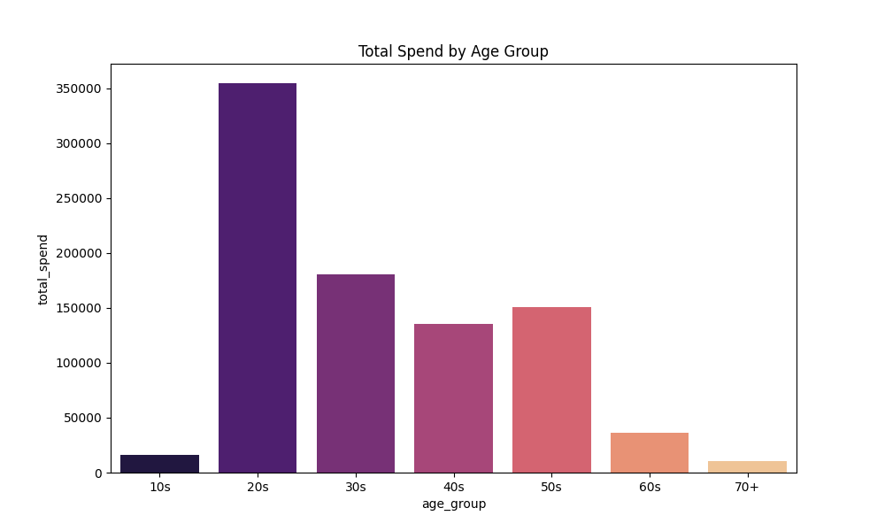

## II. DATA FOUNDATION AND PREPROCESSING ARCHITECTURE

Developing a predictive marketing framework necessitates a highly refined data architecture. The baseline environment involves an extensive catalog and millions of interactions. Without rigorous preprocessing, machine learning algorithms are highly susceptible to popularity bias, data leakage, and memory exhaustion. This section details the structural transformations applied to convert raw transactional logs into high-fidelity artifacts optimized for segmentation and collaborative filtering.

### 1. Data Ingestion and Structural Integrity

Systemic anomalies within high-volume retail data can drastically distort predictive accuracy if left unaddressed. The ingestion phase prioritized the resolution of redundancies, extreme outliers, and memory constraints. 

Original high-cardinality string identifiers—specifically the 64-character hexadecimal customer IDs—were deterministically mapped to contiguous zero-indexed integers. This schema optimization drastically reduces the Random Access Memory (RAM) footprint required for sparse matrix operations, ensuring that subsequent matrix factorization and clustering models scale efficiently without sacrificing referential integrity.

Duplicate transaction detection identified that **17.36%** of the historical logs were exact algorithmic matches across all columns, including timestamp, product, and price. Rather than discarding these as system errors, they were identified as multi-unit purchases occurring within a single checkout event. These records were collapsed into a single transaction utilizing a newly engineered `quantity` feature. This aggregation preserves the true depth of customer engagement while preventing redundant target variables from artificially inflating model confidence.

Outlier management was executed to separate genuine retail consumers from commercial entities. Interaction distributions revealed extreme power users:
*   **Wholesale Resellers:** The top 0.1% of accounts acquired thousands of items individually, with the maximum reaching **1,895 distinct purchases**. Because business-to-business purchasing behavior skews recommendation algorithms through artificial popularity inflation, accounts exceeding a 1,000-item threshold were purged from the consumer training set.
*   **Geographical Anomalies:** A single hashed postal code accounted for over 600,000 transactions. This extreme concentration represents a default system placeholder for missing geographic data. It was explicitly masked as `Unknown` to prevent spatial segmentation algorithms from collapsing into a false center.

### 2. Temporal Architecture and Leakage Prevention

Validating predictive models in E-commerce requires a rigorous chronological partition. Random train-test splitting introduces look-ahead bias, allowing models to utilize future seasonal trends to predict past purchases. 

To ensure realistic evaluation, a strict temporal boundary was established. The final **twenty-eight days** of the dataset were sequestered as an immutable holdout evaluation set. All feature engineering, behavioral profiling, missing value imputations, and cluster assignments were derived exclusively from the preceding training window.

Furthermore, the fast-fashion retail sector is characterized by rapid inventory turnover. Historical interactions become progressively obsolete as seasons change. To capture shifting consumer intent, an exponential time decay weight was engineered for the interaction matrix. The temporal weight $w$ for a given transaction is defined mathematically as:

$$ w = e^{-\lambda \Delta t} $$

where $\Delta t$ represents the days elapsed since the transaction relative to the training period's maximum date, and $\lambda$ is the decay constant calibrated to a **30-day half-life**. This formulation organically phases out discontinued or seasonally obsolete inventory, forcing the collaborative filtering engine to prioritize recent engagements when generating personalized recommendations.

### 3. Affinitive Imputation Strategies

Handling missing demographic data required preserving the underlying structure of the customer base. Naive imputation methods, such as applying global medians, destroy variances crucial for clustering.

Missing age values (affecting approximately 1.16% of the base) were resolved via an **affinitive imputation strategy**. A customer's missing age was inferred by identifying their dominant historical purchase category. Customers demonstrating a purchasing affinity for the `Divided` (youth) line were imputed with an age of 29, while those dominating the `Ladieswear` (mature) index were imputed differently. This targeted approach successfully preserved the complex, bimodal demographic distributions required for the subsequent K-Means Recency, Frequency, Monetary (RFM) clustering.

Binary flags, such as the `Fashion News` and `Active Profile` indicators, exhibited **~65% null rates**. In the context of the platform's database design, a null value indicates an unselected opt-in box rather than missing data. Consequently, these were deterministically imputed as boolean zeroes.

### 4. Processed Feature Dictionary

The culmination of the preprocessing architecture resulted in four optimized artifacts. The structural definitions of the primary interaction and demographic matrices are detailed below.

**Table 1: Processed Interaction Matrix (`train_processed.parquet`)**

| Feature       | Type    | Purpose                           |
| :------------ | :------ | :-------------------------------- |
| `t_dat`       | Date    | Transaction Timestamp             |
| `customer_id` | Int32   | Mapped Primary Key                |
| `article_id`  | Int32   | Mapped SKU Identifier             |
| `price`       | Float64 | Normalized Purchase Price         |
| `quantity`    | UInt32  | Aggregated Unit Volume            |
| `days_ago`    | Int64   | Days since Training Max Date      |
| `time_weight` | Float64 | Exponential Decay (30d half-life) |

**Table 2: Processed Demographic Matrix (`customers_processed.parquet`)**

| Feature              | Type   | Purpose                  |
| :------------------- | :----- | :----------------------- |
| `customer_id`        | Int32  | Mapped Primary Key       |
| `age`                | Int8   | Affinitively Imputed Age |
| `FN`                 | Int8   | Fashion News Sub (0/1)   |
| `Active`             | Int8   | Active Profile (0/1)     |
| `club_member_status` | String | Loyalty Lifecycle Stage  |
| `postal_code`        | String | Masked Location Hash     |

## III. EXPLORATORY DATA ANALYSIS AND BEHAVIORAL INSIGHTS

An exhaustive Exploratory Data Analysis (EDA) was conducted to map consumer behavior and quantify market dynamics. The following insights dictate the algorithmic rulesets governing the recommendation engine and the prescriptive business strategies.

### 1. Demographic Segmentation and Value Distribution

Understanding the demographic makeup of the consumer base is vital for establishing age-aware cold-start baselines. Age distribution analysis reveals a heavily bimodal structure. As illustrated in Figure 1, the platform captures a primary demographic concentration around age twenty-five, representing the core youth market. A distinct, secondary peak emerges near age fifty, indicating a strong mature market segment. 

*Figure 1: Bimodal customer age distribution highlighting distinct youth and mature segments.*

This bimodal reality dictates that generic, platform-wide "trending items" recommendations will fail to capture user nuance. To validate the financial impact of these segments, total expenditure was aggregated by age group. Figure 2 demonstrates that the **20s demographic is the absolute primary revenue driver**, followed sequentially by the 30s and 50s cohorts. Consequently, baseline models for new, anonymous users must dynamically serve popular items specific to their inferred demographic bucket to maximize initial conversion probabilities.

*Figure 2: Total historical expenditure aggregated by decadal age cohorts.*

While not visualized here, further analysis into category-specific age distributions (via interquartile range mapping) confirmed strict boundaries: the `Divided` index is exclusively favored by users under thirty, whereas `Ladieswear` commands a universally wider age spread but dominates the mature segment.

### 2. Product Lifecycle and Market Concentration

Product lifecycle dynamics present the most substantial technical hurdle for personalization. The E-commerce catalog exhibits extreme turnover. Shelf-life calculations—defined as the temporal delta between an article's first and last recorded sale—highlight that the vast majority of products are active for **fewer than ninety days**.

This rapid inventory rotation creates an overwhelmingly sparse user-item interaction matrix, calculated at **99.98% sparsity**. Furthermore, the sales distribution is heavily subjected to popularity bias. As demonstrated by the Lorenz Curve in Figure 3, the market is highly unequal. A remarkably small fraction of "blockbuster" items captures the vast majority of total transaction volume, pushing the curve far away from the line of perfect equality.

*Figure 3: Lorenz curve demonstrating extreme sales concentration (Popularity Bias) within the catalog.*

The combination of a 90-day shelf life and extreme popularity bias means standard matrix factorization techniques will struggle with the "cold-start" problem for fresh inventory. The system must heavily anchor on collaborative item-to-item associations generated during the checkout basket phase to cross-sell deeper catalog items.

### 3. Temporal Dynamics and Seasonality

Transaction volumes exhibit distinct temporal fluctuations that align with broader retail macro-economics. Daily aggregations smoothed over a monthly view (Figure 4) expose a highly cyclical purchasing behavior. 

Significant volume spikes occur during the Spring/Summer transitions (April to July) and peak dramatically during the Winter holiday periods (Black Friday through December). Weekly micro-trends also emerged, with **Saturday representing the peak shopping day**, closely followed by Wednesday. These temporal rhythms reinforce the necessity of the time-decay weight engineered during preprocessing, ensuring that models trained in September do not aggressively recommend April swimwear.

*Figure 4: Macro-seasonality showcasing volume spikes during summer and winter transitions.*

### 4. Customer Retention and Sequential Transitions

Customer retention metrics indicate a clear mandate for predictive churn interventions. A cohort retention heatmap (Figure 5) reveals a severe drop-off in active engagement immediately following a user's initial purchase month. Long-term, multi-year retention stabilizes at an exceptionally low baseline of approximately five percent. 

*Figure 5: Cohort retention heatmap indicating steep immediate drop-offs post-acquisition.*

By establishing a churn threshold at **180 days of inactivity**, the data indicates that **45.5%** of the existing customer base is currently "at-risk." To counteract this, strategic marketing must prioritize recoverable users. Analysis of customer spend velocity (total spend divided by active tenure) isolated a highly actionable segment of "rising stars"—users with short tenures but aggressive purchase volumes. These high-velocity users require immediate retention campaigns before crossing the 180-day churn threshold.

Finally, long-term retention strategies can be informed by organic user evolution. Markov chain evaluations of sequential category purchases (Figure 6) reveal a strong "gravity well" effect. A substantial proportion of consumers organically transition from youth-oriented departments into mature lines over time. 

*Figure 6: Markov transition matrix displaying the high stickiness of Ladieswear and cross-category movement.*

Specifically, `Ladieswear` possesses a **~61% stickiness rate**, while acting as the primary absorption category for aging users from the `Divided` line. This lifecycle progression maps directly to the demographic aging of the customer base, suggesting that recommendation models can drive long-term lifetime value (LTV) by actively cross-pollinating recommendations across these specific lifecycle boundaries.
